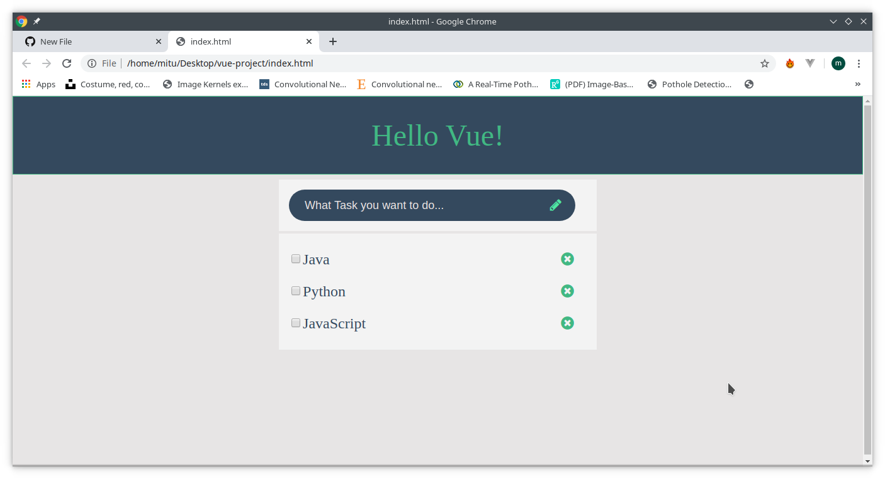

# To-do-Vue
simple ToDo app using Vue js

Simply run index.html file on browser,as there is no need to install vue js or node module it to work.
I have instead used CDN so as to avoid complexity.

<h2>Screenshot :<h2>

